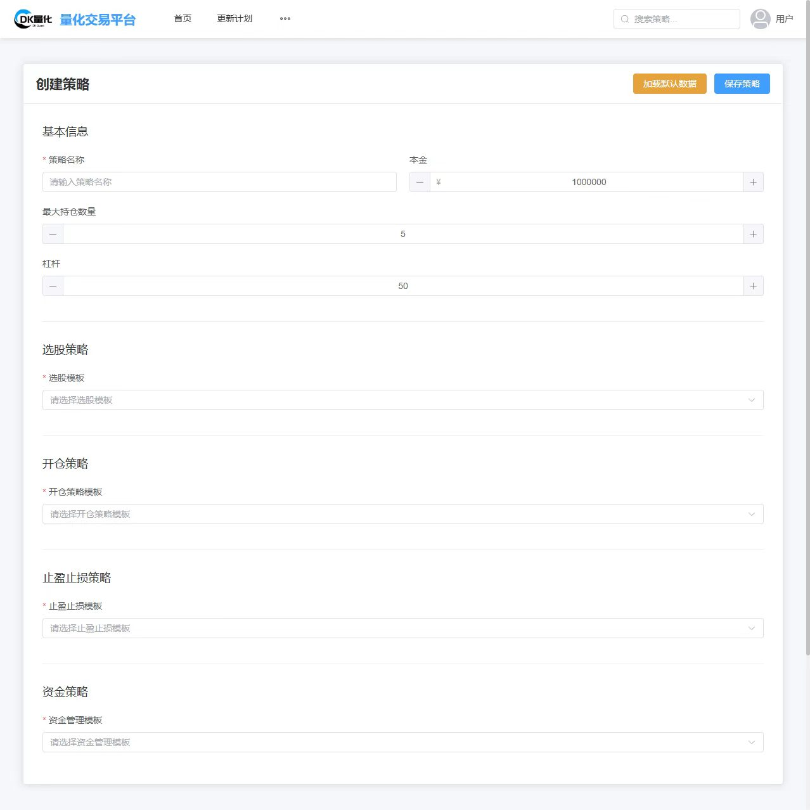

<div align="center">

# DK 量化交易平台

**量化交易系统**

[](https://www.python.org/)
[](https://vuejs.org/)
[](https://www.typescriptlang.org/)
[](https://flask.palletsprojects.com/)
[](LICENSE)

一套从策略创建、回测验证到实盘执行的**完整量化交易闭环**，专为 OKX 合约市场设计。

</div>

---

## 亮点特性

- **可视化策略构建** — 通过 Web 界面拖拽式配置选股、开仓、止盈止损、资金管理四大组件，无需手写代码
- **实时行情驱动** — 基于 OKX WebSocket 推流，毫秒级接收 K 线与 Ticker 数据，策略引擎即时响应
- **回测与实盘一体化** — 同一套策略代码，切换 flag 即可在历史数据上回测，或直连实盘执行
- **多策略并发** — 多线程架构支持同时运行多个独立策略，互不干扰
- **丰富的内置策略** — 涵盖单标的趋势跟踪、多标的轮动、算法交易、网格、对冲套利等多种范式
- **完善的风控体系** — 动态止盈、强平预警止损、仓位递增控制、订单超时取消，多层防护
- **微信实时推送** — 仓位变动、风险预警通过企业微信机器人即时通知

---

## 系统架构

```
┌─────────────────────────────────────────────────────┐
│                   Vue 3 前端                         │
│         策略管理 · 行情看板 · 个人中心               │
└──────────────────────┬──────────────────────────────┘
                       │ HTTP / REST
┌──────────────────────▼──────────────────────────────┐
│              Flask 主引擎 (main_Engine.py)            │
│         策略加载 · 生命周期管理 · REST API            │
└────────┬─────────────────────────┬───────────────────┘
         │ WebSocket               │ 线程
┌────────▼──────────┐   ┌──────────▼──────────────────┐
│  WebSocketManager  │   │      SimulationEngine        │
│  实时行情推流      │   │      历史回测引擎             │
└────────┬──────────┘   └─────────────────────────────┘
         │
┌────────▼──────────────────────────────────────────┐
│                  OKX Exchange API                   │
│   Account · Market · Trade · Public · TradingBot    │
└───────────────────────────────────────────────────┘
```

---

## 技术栈

| 层级 | 技术 |
|------|------|
| **前端** | Vue 3 + TypeScript · Vite · Element Plus · ECharts · Pinia · Axios |
| **后端** | Python 3.8+ · Flask · WebSockets · asyncio · threading |
| **数据处理** | Pandas · NumPy · SciPy · TA-Lib |
| **交易所** | python-okx · OKX WebSocket v5 |
| **数据库** | MySQL (PyMySQL · SQLAlchemy) |
| **AI 辅助** | OpenAI API |
| **安全** | cryptography · bcrypt · JWT |

---

## 核心模块

### 策略引擎

策略由四个**独立可插拔**的组件组合而成：

```
┌──────────────┐  ┌──────────────┐  ┌──────────────┐  ┌──────────────┐
│  标的筛选     │→│   开仓策略    │→│  止盈止损     │→│   资金管理    │
│SymbolSelector│  │ OpenPosition │  │ ProfitLoss   │  │  FundManager │
└──────────────┘  └──────────────┘  └──────────────┘  └──────────────┘
```

- **标的筛选** — 按成交量、涨幅、价格区间等条件动态筛选交易对
- **开仓策略** — 支持均线、MACD、RSI、布林带、自定义逻辑等多种信号
- **止盈止损** — 固定比例、动态跟踪止盈、强平预警止损可组合配置
- **资金管理** — 等额、仓位递增（马丁）、固定比例等资金分配策略

### 内置策略清单

| 策略 | 文件 | 说明 |
|------|------|------|
| 单标的趋势 v1–v4 | `one_symbol_trade*.py` | 迭代演进的单币种趋势策略 |
| 多标的轮动 | `multi_symbol_trade.py` | 同时监控多个交易对 |
| 算法交易 | `algotrade.py` | 结合技术指标的综合算法 |
| 对冲套利 | `Hedge_arbitrage.py` | 双向持仓对冲降低方向风险 |
| 高频交易 | `quick_trade.py` | 短周期高频信号捕捉 |
| 网格策略 | `grid_strategy.py` | 震荡行情区间套利 |

---

## 快速开始

### 环境要求

- Python 3.8+
- Node.js 18+
- OKX 账户 + API Key（需开启合约交易权限）

### 后端启动

```bash
cd okx_quant

# 安装依赖
pip install -r requirement.txt

# 配置 API 密钥
cp functionns/setting.example.py functionns/setting.py
# 编辑 setting.py，填入你的 OKX API Key、Secret Key、Passphrase

# 启动交易引擎
python Quant_Engine/main_Engine.py
```

### 前端启动

```bash
cd dkquantweb/dkquantweb

# 安装依赖
npm install

# 开发模式（访问 http://localhost:5173）
npm run dev

# 生产构建
npm run build
```

### 配置说明

编辑 `okx_quant/functionns/setting.py`：

```python
flag = '1'   # '0' 实盘  |  '1' 模拟盘（建议新用户先用模拟盘测试）

# 实盘配置
api_key    = "YOUR_LIVE_API_KEY"
secret_key = "YOUR_LIVE_SECRET_KEY"
passphrase = "YOUR_LIVE_PASSPHRASE"
```

> **安全提示：** `setting.py` 已加入 `.gitignore`，不会被提交到代码仓库。请勿将真实密钥硬编码后上传。

---

## 项目结构

```
DK-project/
├── dkquantweb/dkquantweb/      # Vue 3 前端应用
│   └── src/
│       ├── api/                # 按业务域划分的 API 模块
│       ├── views/              # 页面组件（首页/策略/用户中心等）
│       ├── stores/             # Pinia 状态管理
│       └── router/             # 路由与权限守卫
│
├── okx_quant/                  # Python 交易引擎
│   ├── Quant_Engine/
│   │   ├── main_Engine.py      # 主引擎 + Flask API
│   │   ├── simulation_Engine.py# 回测引擎
│   │   ├── WebSocketManager.py # 实时行情管理
│   │   ├── strategies/         # 内置策略实现
│   │   └── template/           # 策略组件模板
│   ├── functionns/             # 策略函数库
│   │   ├── setting.example.py  # 配置文件示例
│   │   └── ...
│   └── okx/                    # OKX SDK（15+ API 模块）
│
└── RuoYi-Vue-master/           # 后台管理框架（参考）
```

---

## 风险提示

> 加密货币合约交易存在**高度市场风险**，包括但不限于爆仓、流动性不足和极端行情风险。
>
> - 本项目仅为技术实现参考，不构成任何投资建议
> - 请务必在**模拟盘**充分测试后再切换实盘
> - 建议从小仓位开始，逐步验证策略稳定性
> - 作者不对任何使用本项目产生的交易损失承担责任

---

## License

[MIT](LICENSE) © 2024 DK Quant
